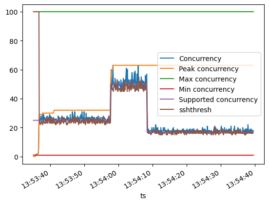

# Sawtooth 🪚

Sawtooth is a utility for congestion control using additive increase and multiplicative backoff. The algorithm is based on [this blog post](https://www.aeoncase.com/blog/posts/improve-on-exponential-backoff/).



## Getting started

```
pip install sawtooth
```

### Basic usage

```python
from sawtooth import Sawtooth, SawtoothBackpressure
import asyncio
from aiohttp import ClientSession 
from aiohttp.web_exceptions import HTTPTooManyRequests

async def main():
    session = ClientSession()
    sawtooth = Sawtooth(session)

    with open('urls.txt') as f:
        urls = f.readlines()
    
    async def get_url(url: str):
        async with sawtooth.resource() as s:
            res = await s.get(url)
            # Raise backpressure on 429
            if res.status == HTTPTooManyRequests.status_code:
                raise SawtoothBackpressure()

    await asyncio.gather(*[get_url(url) for url in urls])

    await session.close()
```

## Configuration

A `Sawtooth` instance can be configured by passing an instance of `SawtoothConfig` as its second parameter.

```python
sawtooth = Sawtooth(resource, SawtoothConfig(max_concurrency=100, min_concurrency=50))
```

The following options are available:

| Name                         | Description                                                                                                                           |    Default    |
| -------------                | -------------                                                                                                                         | ------------- |
| *max_concurrency*            | The maximum value we can increase concurrency to                                                                                      |   **1000**    |
| *min_concurrency*            | The minimum value we can reduce concurrency to                                                                                        |     **1**     |
| *step_size*                  | The amount to increase concurrency by on a successful response                                                                        |     **1**     |
| *backoff_factor*             | Reduce concurrency to `concurrency * backoff_factor` upon receiving backpressure                                                     |   **0.95**    |
| *starting_concurrency*       | Starting concurrency.                                                             |   **(max_concurrency - min_concurrency) / 2**    |
